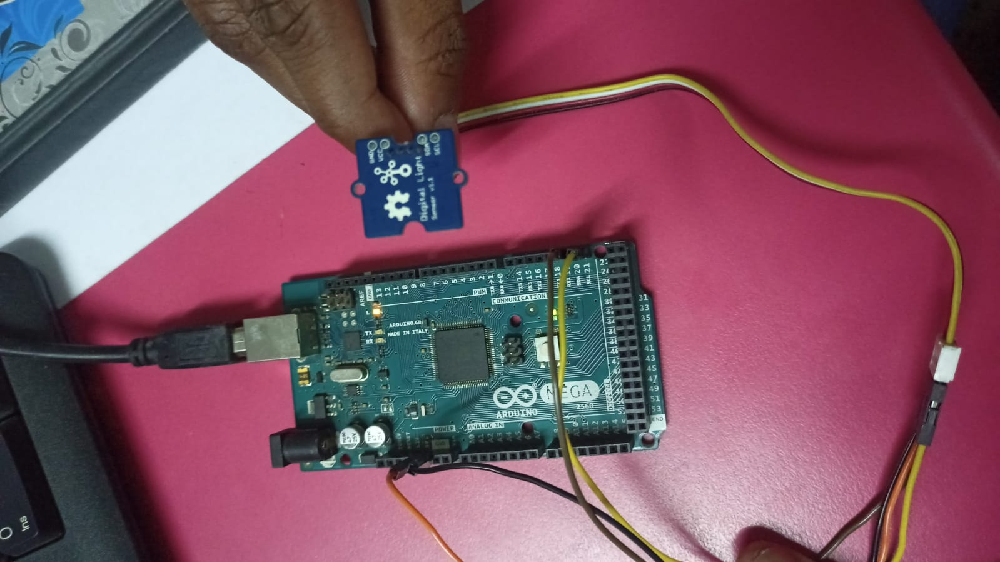
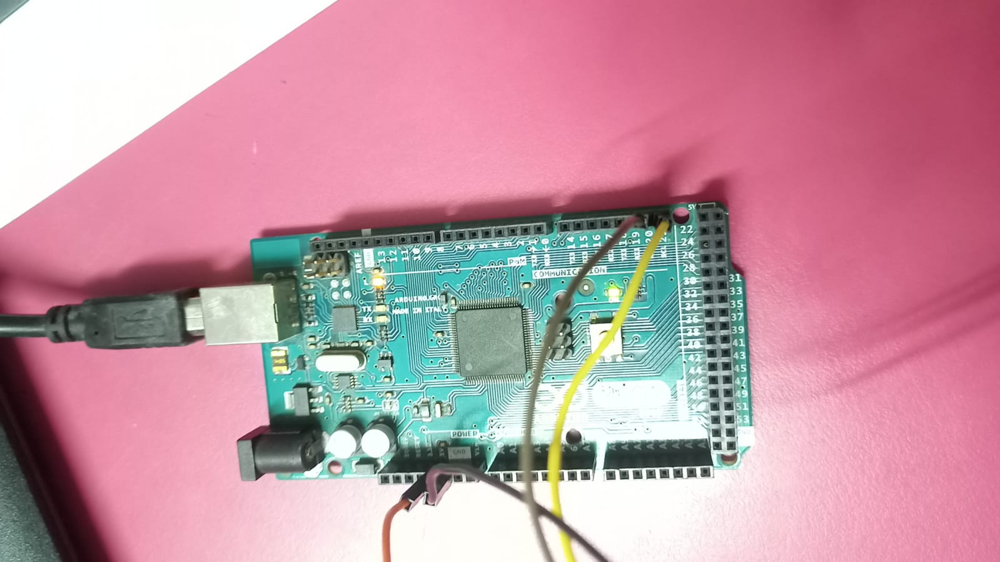
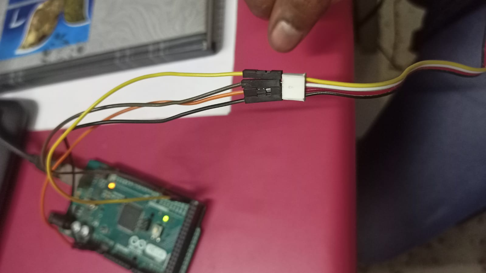

# Arduino_with_Digital_Light_Sensor_Grove
This repository contains interfacing details of Arduino with Digital Light Sensor v1.1 (Grove), along with the code for getting the light intensity at point of time.

The whole connection is shown as follows:-

The detailed picture of Arduino connection is as follows:-

The main point in above connection is that:-

  1. VCC of Digital Light Intensity Sensor must be connected to 5V pin(Analog side) of the Arduino.
  2. GND of Digital Light Intensity Sensor must be connected to GND pin(Analog side) of the Arduino.
  3. SDA of Digital Light Intensity Sensor must be connected to SDA pin(Digital side) of the Arduino.
  4. SCL of Digital Light Intensity Sensor must be connected to SCL pin(Digital side) of the Arduino.

Connectors zoomed picture:-

After the necessary connections are made, follow the code given in this repository under the directory named light_sensor and upload it on Arduino using the Arduino IDE.

